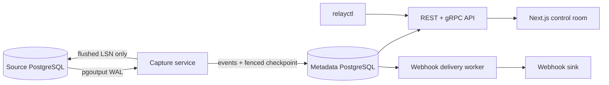
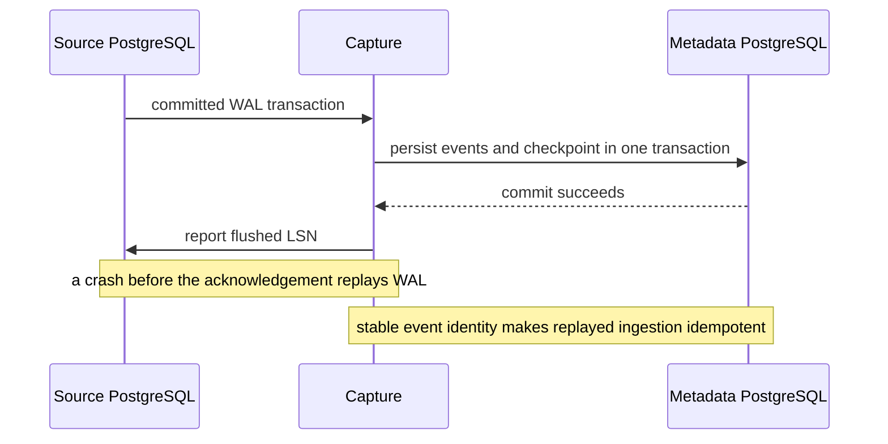

# RelayDB

RelayDB is an inspectable PostgreSQL change-data-capture project written in Go.
It reads PostgreSQL logical replication, persists normalized changes with a
durable WAL checkpoint, and exposes an operations dashboard for examining
capture, event history, webhook delivery, and dead letters.

It is deliberately a compact CDC system for learning and portfolio review, not
a replacement for Debezium, Kafka, or a managed event platform. The important
question it tries to make inspectable is: *what survives when capture, a
consumer, or a webhook destination fails?*

## What It Does

RelayDB reads committed changes from a PostgreSQL publication through
`pgoutput`. Capture stores the transaction's normalized events and advances the
metadata checkpoint together. Only after that transaction commits may capture
report the flushed LSN back to PostgreSQL.



The local Compose stack includes a source PostgreSQL instance configured for
logical replication, metadata PostgreSQL, API, capture, delivery, Prometheus,
and the dashboard. An optional demo-commerce service creates order traffic
against the source database.

## The Capture Invariant

RelayDB makes an at-least-once ingestion claim, not an exactly-once side-effect
claim. Its safety boundary is the metadata transaction:



This means:

- Events are persisted before RelayDB acknowledges the corresponding WAL.
- A capture crash after persistence but before acknowledgement can replay WAL
	without creating a second durable event identity.
- Consumers and webhooks are at least once. Downstream side effects must use
	their own idempotency key.
- Lease generation is the fencing boundary for consumer ownership; an old owner
	must not advance a newer owner's cursor.

## Inspect The Dashboard

The dashboard is an operations surface, not a marketing page. It has two
explicit data modes, selected with the mode control in the sidebar:

- **Demo** is the default. It renders deterministic CDC evidence: a
	multi-table order transaction, source health, webhook dead letter, consumer
	lease/retry/poison states, and representative replay cursors. It needs no
	API or database.
- **Live** reads the configured RelayDB API through the server-side BFF proxy.
	It never substitutes fixtures when the API is unavailable, empty, or does
	not yet expose a capability.

Open `http://localhost:3000/?mode=demo` for the deterministic review surface.
Use `?mode=live` to inspect the running Compose/API stack.

The dashboard keeps the reader API key on the server-side BFF. Browser code
calls same-origin `/api/v1/*`; it does not receive the key.

## Run Locally

Start the core services:

```bash
docker compose up -d source-postgres metadata-postgres api capture-1 delivery dashboard
```

Open the dashboard:

```text
http://localhost:3000/?mode=demo
http://localhost:3000/?mode=live
```

Generate source activity:

```bash
docker compose --profile demo up -d demo-commerce
curl -X POST http://localhost:8081/orders \
	-H "Content-Type: application/json" \
	-d '{"customer_id":1,"items":[{"product_id":1,"quantity":1}]}'
```

Once capture is running, inspect the event stream through the dashboard or API:

```bash
curl -H "Authorization: Bearer reader:dev-reader-key-change-in-production" \
	http://localhost:8080/api/v1/events
```

Never use the Compose credentials outside local development.

## Development And Validation

RelayDB uses Go 1.26.5, Docker, PostgreSQL 16, pnpm, and Buf.

```bash
make fmt
make vet
make lint
make proto
make test
make race
make compose-config
```

The dashboard can be checked independently:

```bash
pnpm --dir dashboard exec tsc --noEmit
pnpm --dir dashboard build
```

Integration and failure-test targets exist under `tests/integration` and
`tests/failure`. They require Docker and are being expanded into real
logical-replication proof scenes; do not treat the current scaffolding as a
production certification.

## Capability Boundary

The repository has a working local capture/dashboard path, webhook delivery
loop, source/event read API, and deterministic dashboard evidence. The
following work is intentionally not presented as complete:

- Consumer NACK/redelivery policy and poison-message persistence are under
	active implementation and need PostgreSQL failure coverage.
- Replay session storage exists, but replay cursor execution and destination
	routing are not yet live. The dashboard's Live replay page states this.
- `relayctl` command dispatch exists, but its authenticated HTTP client and
	functional command implementations are still being completed.
- Consumer/replay dashboard telemetry is represented in Demo mode only until
	backed Live API endpoints and runtime proof suites land.
- A hosted deployment has not been created because Railway account billing is
	currently blocked. The production topology and required variables are in
	[docs/deployment.md](docs/deployment.md).

That boundary is deliberate: Demo mode demonstrates the intended operational
shape, while Live mode reports only behavior the running service can actually
provide.

## Deployment

The intended deployment topology is Vercel for the dashboard and a container
host such as Railway for API, capture, delivery, demo-commerce, source
PostgreSQL, and metadata PostgreSQL. Read
[docs/deployment.md](docs/deployment.md) for required variables, persistent
source volume requirements, local smoke checks, and the current hosted-deploy
prerequisite.

## License

MIT