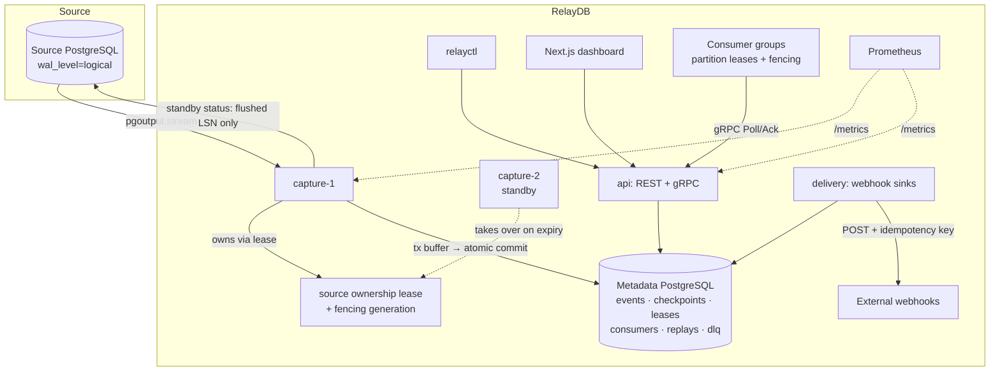
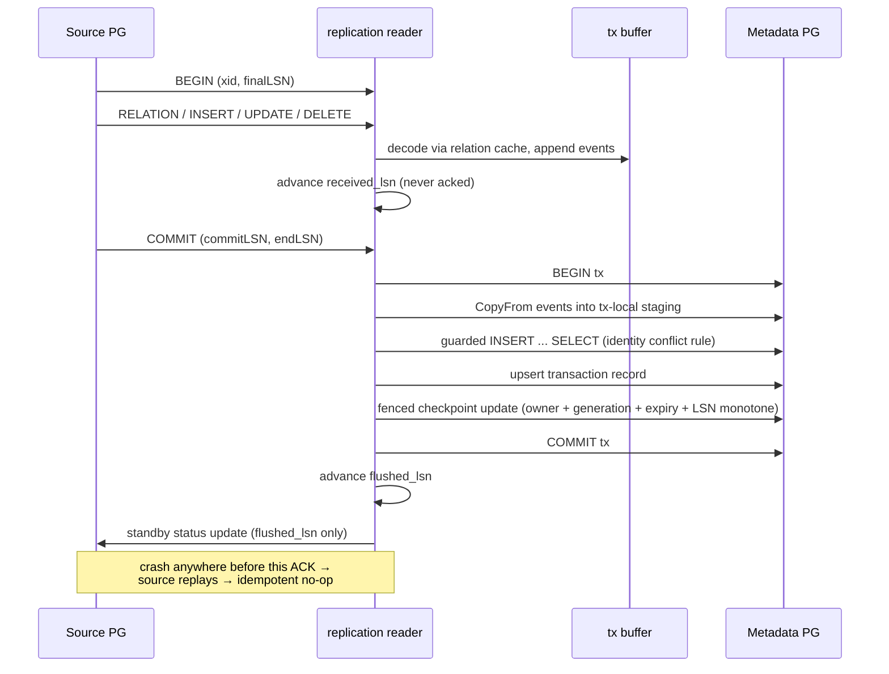
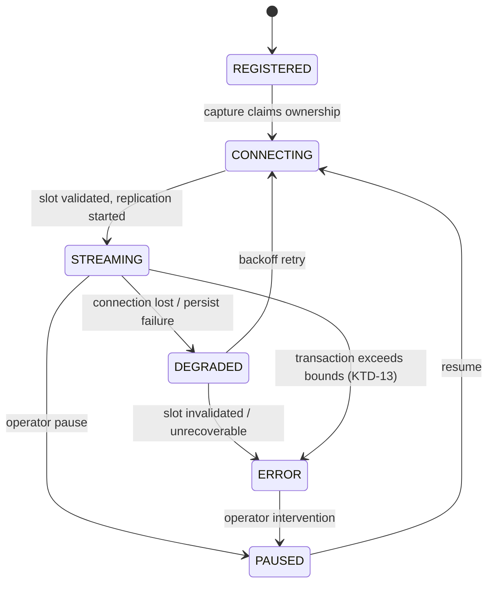
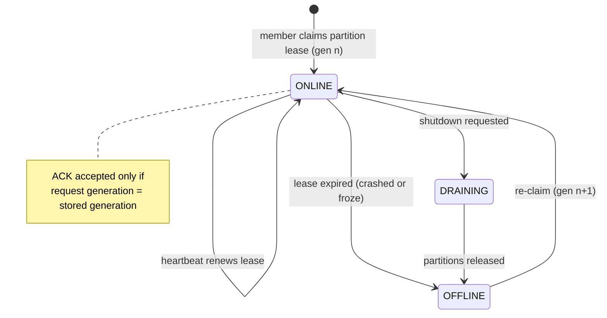

# feat: RelayDB — PostgreSQL CDC and Replay Platform

**Target repo:** `relaydb` (new sibling repo of `durablego`, created fresh at workspace root). All paths below are relative to the `relaydb` repo root unless prefixed with `durablego/` or `portfolio/` (patterns borrowed from sibling repos).

## Summary

Build RelayDB, a production-style PostgreSQL change-data-capture and replay platform in Go: logical-replication capture with crash-safe LSN checkpointing, a durable event store, consumer groups with partition leases and fencing tokens, replay sessions, webhook sinks with retry/DLQ, Prometheus/OTel observability, a Next.js operations dashboard, and a `relayctl` CLI. The plan executes the full seven-phase roadmap from the brief as phased delivery, with crash correctness (Phase 2) gated before any consumer or sink work begins.

---

## Problem Frame

The portfolio needs a flagship infrastructure project that proves deep PostgreSQL and distributed-systems competence — WAL internals, LSN handling, transaction boundaries, durable checkpointing, and crash recovery — rather than another wrapper around polling queries. The brief mandates real logical replication, real-PostgreSQL integration tests, and honesty about delivery semantics (at-least-once, never exactly-once). The nearest sibling codebase, `durablego`, contributes proven lease/fencing/persistence patterns but has no replication, consumer, or event-store machinery — so the core CDC layer is greenfield inside an established set of conventions.

The two invariants that dominate every design decision:

- **Source invariant.** Never acknowledge a WAL position to PostgreSQL until the corresponding committed events and checkpoint are durably persisted in the metadata database.
- **Consumer invariant.** A partition offset may only advance under the current valid lease generation; stale consumers must be fenced.

---

## Requirements

**Capture and durability**

- R1. Capture committed INSERT, UPDATE, and DELETE row changes from a source PostgreSQL 16+ database using logical replication (`pgoutput` plugin); no application-level polling.
- R2. Preserve transaction boundaries: row events become visible only after the source transaction's COMMIT is received, and events carry xid, commit LSN, commit timestamp, and per-transaction sequence numbers.
- R3. Persist each committed transaction atomically — events, transaction record, and source checkpoint in one metadata-database transaction — and only then acknowledge the LSN to the source.
- R4. Make event persistence idempotent under WAL replay via a stable unique identity, so a crash after metadata commit but before source ACK produces no duplicate durable events.
- R5. Reconnect after source disconnection with bounded exponential backoff and resume from the last durably persisted checkpoint without losing committed events.
- R6. Track `received_lsn`, `persisted_lsn`, and `acknowledged_lsn` as distinct concepts; expose replication-slot retained WAL and capture lag as first-class metrics.
- R7. Handle large source transactions (100k+ rows) within configured memory bounds without crashing.
- R8. Prevent split-brain capture: exactly one capture instance owns a source at a time, enforced by a durable ownership lease with a fencing generation on every checkpoint update.

**Consumption**

- R9. Provide a gRPC pull API (Poll / Ack / Nack / Heartbeat) with batched event delivery and durable per-group, per-partition offsets.
- R10. Support consumer groups where each group sees the full stream independently and partitions are divided among group members.
- R11. Guarantee event order within a source partition; partition assignment is deterministic via `hash(event_key) % partition_count`. No global ordering claim.
- R12. Fence every ACK by lease generation: a stale consumer's ACK must be rejected.
- R13. Support NACK with retry-delay redelivery and attempt tracking; poison events dead-letter (or halt the partition) per a configured `poison_event_policy`.
- R14. Provide replay sessions (by time range, LSN, or event ID) with their own cursor, never mutating live consumer offsets; replay destinations: consumer API, webhook, JSONL file.

**Delivery**

- R15. Deliver events to webhook sinks via HTTP POST with a stable event-ID idempotency header, capped exponential backoff with jitter, selective status-code retries, and a dead-letter queue with manual retry.

**Platform**

- R16. Expose a REST API for sources, events, transactions, consumers, replays, sinks, DLQ, health, and metrics; never expose raw source credentials through read APIs; encrypt stored credentials with AES-GCM envelope encryption keyed from the environment.
- R17. Expose Prometheus metrics and OpenTelemetry traces at batch granularity (not per-row) with `slog` structured logging.
- R18. Provide a Next.js dashboard covering sources, source detail with capture-lag graphs, an event explorer, a transaction explorer, consumer/group/partition status, replay progress, and DLQ management.
- R19. Provide a `relayctl` CLI with source list/status, events tail (table and JSON formats), consumer lag, replay, and DLQ list/retry commands.
- R20. Start the entire environment (source PG, metadata PG, api, two capture replicas, delivery, dashboard, Prometheus) with `docker compose up`, including a seeded commerce schema and a demo app that generates order activity.

**Verification**

- R21. Integration tests run against real PostgreSQL (testcontainers), covering INSERT/UPDATE/DELETE capture, multi-row and multi-table transactions, reconnect, ordering, checkpoint persistence, duplicate WAL replay, offset commits, and redelivery.
- R22. Failure tests cover every crash window: kill before persistence, kill after persistence/before ACK, metadata DB outage, source restart, consumer crash before ACK, stale consumer ACK, racing capture replicas, webhook timeout, poison event, and large transactions.
- R23. CI runs fmt, vet, golangci-lint, unit tests, integration tests, `go test -race ./...`, binary builds, and Docker builds.
- R24. Produce honest benchmarks via a `cmd/loadgen` tool with documented environment and methodology; publish actual results, achieved or not.
- R25. Document the guarantees explicitly: durable at-least-once ingestion, no exactly-once side effects, replay bounded by retention, and replica-identity caveats.

---

## Key Technical Decisions

**Protocol and capture**

- **KTD-1. Go 1.25+ toolchain, not 1.24.** pgx v5.10+ and OpenTelemetry-Go v1.45 both require Go 1.25 as their minimum; pinning 1.24 falls off the supported window immediately. (The brief's "1.24+" is superseded.)
- **KTD-2. `pgoutput` output plugin, protocol version 1, `streaming=off`, `two_phase=false` for v1.** pgoutput is the only plugin pglogrepl decodes natively and ships in core PostgreSQL, including managed offerings. Streaming in-progress transactions (proto v2+) requires manual `inStream` tracking and abort handling; it is deferred to Phase 7 spill work, since v1 buffers per transaction and emits at commit.
- **KTD-3. Two-LSN state machine in the capture service.** Track `received_lsn` (advanced on every XLogData) separately from `flushed_lsn` (advanced only after the metadata transaction commits). `SendStandbyStatusUpdate` defaults flush←write, so only ever report a flushed LSN — reporting a merely-received LSN tells PostgreSQL to release WAL we cannot recover. Reply immediately to keepalives with `ReplyRequested`, and heartbeat the status on a ~10s ticker.
- **KTD-4. Two connection regimes, never mixed.** The replication connection is a raw `*pgconn.PgConn` with `replication=database`, never pooled. The metadata DB uses a `pgxpool.Pool` with `MinIdleConns`, `MaxConnLifetimeJitter`, and `PingTimeout` set explicitly, pool stats exported as metrics.
- **KTD-5. Event identity is `(source_id, commit_end_lsn, sequence_number)`.** XIDs wrap and are not unique across time; a replayed transaction re-derives the same key, making crash-replay a no-op. A payload-hash mismatch on a conflicting identity aborts the metadata transaction rather than silently accepting corruption.
- **KTD-6. Event IDs are ULIDs (`oklog/ulid/v2`) stored as `bytea`.** Matches the brief's `01K...` shape; `ulid.Make()` is concurrent-safe and monotonic within a millisecond. `bytea` keeps the index at 16 bytes and satisfies `CopyFrom`'s binary-format requirement. Events table uses text/smallint, never PG enums, for the same COPY reason.
- **KTD-7. Atomic ingest is COPY-to-staging plus guarded set-based insert, inside one metadata transaction per source transaction.** PostgreSQL `COPY` has no `ON CONFLICT`, so `CopyFrom` loads a transaction-local staging table; a set-based `INSERT ... SELECT` applies the identity conflict rule, an equality probe over the versioned payload hash detects corrupt replays, and the fenced checkpoint update rides in the same `pgx.Tx`. One `IngestCommittedTransaction` operation owns the whole transaction; no unit outside its PostgreSQL adapter touches `pgx.Tx`. A single source transaction stays a single metadata transaction — chunked commits would break atomicity, so large transactions are bounded by resource budgets (U5), not splitting.
- **KTD-8. Startup validation of replica identity; refuse tables set to `NOTHING`.** Query `pg_class.relreplident` for every published table at source registration and reconnect. `USING INDEX` silently degrades to `NOTHING` if the index is dropped, so it is validated but not recommended. Baseline guidance is `DEFAULT` (PK old values); `REPLICA IDENTITY FULL` is per-table opt-in for consumers needing before-images. Events record replica-identity state and represent missing before-images explicitly as `null`/partial, never silently.
- **KTD-9. Tuple decoding distinguishes null, unchanged-TOAST, and absent.** pgoutput's `'u'` discriminator means "value not sent" — the classic CDC data-loss bug. The event envelope carries a per-column state so downstream consumers never confuse "unchanged" with "null".
- **KTD-10. Schema versioning via a replay-idempotent relation-history table.** Each observed Relation message is fingerprinted; `relation_versions` enforces `UNIQUE(source_id, relation_oid, fingerprint)` with an idempotent lookup-or-insert returning one stable version identity. New versions are persisted in the same metadata transaction as the events that reference them, so reconnect replays and racing capture replicas converge on one row. Historical before/after JSONB is interpreted against the version current at decode time, never re-interpreted under current schema. (User decision: fingerprint + history table, not minimal, not a registry.)
- **KTD-11. Import direction is fixed; transport never coordinates persistence.** `replication` owns protocol decode only and imports no storage package. A neutral `event` package owns the immutable envelope and stream positions. `capture` orchestrates the stream and calls narrow ownership/ingest ports. `eventstore` provides durable event queries, not capture orchestration. `consumer` exposes a transport-independent application service; `api`/`grpc` only authenticate, map DTOs and errors, and invoke services. This blocks the circular-import and leaky-interface failure modes the deepening review flagged.
- **KTD-12. The canonical stream position is `(commit_end_lsn, sequence_number)`; partition topology is versioned.** Consumer offsets, replay cursors, and ordering guarantees are all expressed in this position. ULIDs identify rows operationally but are not the ordering primitive. The partition hash (FNV-1a over normalized event-key bytes) is versioned, `partition_count` is fixed at group creation, and changing it creates a new group rather than remapping history.
- **KTD-13. Capture flow control is explicit, and oversized transactions are a source-blocking operator incident.** The replication connection is single-goroutine for receive and send (pgconn is not safe for concurrent use); a bounded channel hands decoded messages to the persister, so slow persistence backpressures WAL reads instead of growing memory. While paused, the status loop still answers keepalives with the last flushed LSN. A transaction exceeding configured bounds halts capture for that source with an ERROR status and an operator pause/resume path — v1 refuses rather than spilling; spill is Phase 7 only if profiling demands it. A reconnect loop is never the terminal state.

**Consumption and delivery**

- **KTD-14. Postgres-backed partition leases with fencing tokens, expiry-checked on every write.** Partition claims use `FOR UPDATE SKIP LOCKED` with a generation increment, adapted from [durablego/internal/persistence/postgres.go](durablego/internal/persistence/postgres.go). Every ACK is one conditional row update requiring owner match, generation match, `lease_expires_at > now` (database time), and a monotonically advancing offset — generation alone cannot fence the expired-but-not-yet-reclaimed window. Zero rows affected means stale ownership: roll back, never advance. Heartbeat interval ≤ lease_duration/3.
- **KTD-15. Consumer offsets are keyed `(group_id, source_id, partition)` with the canonical `(commit_end_lsn, sequence_number)` cursor.** ACKs bind to a persisted issued batch range, so a valid lease holder cannot skip arbitrarily ahead; repeated polls while a batch is in flight do not create uncontrolled duplicate deliveries beyond the at-least-once contract.
- **KTD-16. Capture ownership lives on `source_checkpoints`, fenced by owner + generation + expiry + LSN monotonicity.** Keeping ownership on the checkpoint row makes the fencing predicate part of the same row lock as the checkpoint write — a split lease table would require cross-row locking in every ingest transaction. A stale replica's write affects zero rows and rolls back; an equal-LSN replay is accepted only after ownership and payload-hash verification. The LSN reported in logs/metrics is "last status sent" — the source's receipt is not observable from the client.
- **KTD-17. Webhook egress is allowlisted and signed.** HTTPS only (HTTP permitted for loopback demo targets); a controlled dialer rejects loopback/private/link-local/metadata IPs and re-validates resolved IPs per connection against DNS rebinding; redirects off by default; bounded timeouts and capped response bodies in attempt history. Each sink gets its own encrypted secret; deliveries sign body + timestamp + event ID with HMAC-SHA-256 in a versioned header, so receivers get authenticity and replay protection, not just idempotency. Retry classification stays configurable, defaulting to selective: retry timeouts, connection failures, 408/425/429, and 5xx with a bounded `Retry-After`; treat 400/401/403/404/410/422 as permanent by default. Delivery enforces global and per-sink concurrency limits and a circuit breaker so one failing sink cannot create a retry storm.
- **KTD-18. gRPC codegen via `buf` with pinned plugins and a versioned proto package.** Declarative plugin versions plus `buf lint`/`buf breaking` protect the consumer-facing event schema. Start with unary Poll/Ack/Nack/Heartbeat; streaming subscribe is Phase 3+ only if profiling justifies it. REST paths live under `/api/v1`; relation `schema_version`, event-envelope version, and transport API version are distinct concepts and named accordingly.

**Observability and testing**

- **KTD-19. Metrics on `client_golang` with a custom registry; traces on OTel; never both metrics stacks.** OTel's Prometheus bridge is metrics-only and one-directional — pick `client_golang` for metrics and OTel strictly for traces. Logs stay on `slog` (OTel Logs is still Beta).
- **KTD-20. Native histograms for latency percentiles.** Summaries cannot be aggregated across capture replicas — fleet-wide p99 from averaged quantiles is statistically meaningless. Use `NativeHistogramBucketFactor: 1.1` with `NativeHistogramMaxBucketNumber` set (DoS guard), plus classic buckets for compatibility.
- **KTD-21. OTel spans at batch granularity.** One span per CDC drain cycle (`cdc.batch`) with `batch.size`/`lsn.start`/`lsn.end` attributes; per-row spans at target throughput would DoS the collector. `ParentBased(TraceIDRatioBased)` sampling via `autoexport` env configuration.
- **KTD-22. Integration tests use testcontainers-go with real PostgreSQL 16/17.** Pinned images started with `-c wal_level=logical`; wait on the readiness log line twice plus port. Lease-expiry and ticker tests use `testing/synctest` (GA in Go 1.25) for deterministic virtual time instead of sleeps. GitHub Actions service containers cover the fixed-topology end-to-end suite.
- **KTD-23. No `contracts.go`-style aspirational interfaces.** DurableGo's contracts file drifted from its implementation; RelayDB defines narrow interfaces at consumption sites and keeps them compiled against their implementations.

**Security**

- **KTD-24. Credential envelope encryption with a full lifecycle.** Versioned ciphertext envelope (algorithm, master-key ID, wrapped DEK), independent random 96-bit GCM nonces for DEK wrap and credential encryption, and AAD binding `source_id` + envelope version + purpose. Master key is validated base64 256-bit material from `RELAYDB_MASTER_KEY`; rotation rewraps DEKs with an active-plus-decrypt-only key set rather than re-encrypting credentials. Plaintext exists only long enough to build the `pgconn.Config` — never cached, logged, placed in errors/metrics, or formatted into a DSN string; Go's memory model makes complete erasure best-effort, documented as such. Read APIs return connection metadata with credentials redacted. Dashboard source creation is restricted to preconfigured sources in the hosted demo. (Pulled forward from the brief's Phase 3 per user decision.)
- **KTD-25. Auth model: demo-scoped API keys, applied uniformly across REST and gRPC.** Separate admin and read/operator keys; randomly generated, stored hashed, identified by non-secret key IDs, compared in constant time, rotatable, never logged. TLS required for any non-loopback deployment, gRPC included. The dashboard keeps keys server-side behind a BFF boundary — no bearer key in browser JavaScript. Hard safety caps ship now: request-body limits, pagination maxima, query timeouts, bounded replay ranges, and per-key concurrent-replay quotas. Tenant-grade rate limiting and RBAC stay out of scope per the brief.
- **KTD-26. Row payloads are confidential data everywhere they surface.** `slog` logging uses field allowlists — never before/after payloads, credentials, auth headers, webhook bodies, or full responses. Client-facing errors are normalized so SQL/parse/delivery failures cannot leak row data or secrets; operators get sanitized correlation IDs. JSONL exports and CLI payload output are documented as sensitive and require the operator key. The hosted demo masks or disables payload inspection in the dashboard.

---

## High-Level Technical Design

### System topology



### Crash-safe commit pipeline (the core invariant)



### Source and consumer state machines





---

## Scope Boundaries

In scope for this plan: the full seven-phase roadmap (raw CDC, crash correctness, consumers, replay & sinks, observability, dashboard, performance), AES-GCM credential encryption from day one, and honest benchmarking. Streaming in-progress large transactions (`streaming=on`, proto v2+) are conditionally in scope for Phase 7 only, gated on profiling evidence (KTD-2, U14).

**Deferred for later** (post-roadmap, deliberately excluded from all seven phases):

- Initial snapshot/backfill mode (brief §39) — technically difficult; core CDC correctness comes first.
- TRUNCATE event support.
- Column-level filter predicates and any query language.
- Event retention/cleanup jobs (brief §60) — replay is bounded by retention; documented, not yet implemented. The initial schema still pins deletion semantics so the deferred job cannot corrupt dependents: restrictive FKs keep replays, pending deliveries, and DLQ rows attached to their events, and a future retention watermark is defined as the minimum position still needed by live offsets, active replays, pending deliveries, and DLQ policy. A replay whose range has been pruned transitions to `EXPIRED` — it never silently completes against missing events.
- Bi-directional replication / `origin` loop-avoidance.
- Failover-slot support (PG17+) and the explicit re-snapshot path after primary failover.
- Streaming gRPC subscribe RPC.

**Outside this product's identity** (brief §94): Kafka/Pulsar/NATS, Debezium dependency, Kubernetes operator, multi-region, custom Raft, schema registry, SQL transformation language, OAuth, billing, RBAC, connector zoo.

---

## Risks & Dependencies

| Risk | Impact | Mitigation |
|---|---|---|
| pglogrepl has no tagged releases (pseudo-version only) | API drift on upgrade | Pin the exact pseudo-version in `go.mod`; upgrade deliberately with the integration suite as the gate |
| Stuck consumer pins WAL via its replication slot | Source disk exhaustion, slot invalidation → unrecoverable gap | `max_slot_wal_keep_size` budget on the source; alert on `wal_status`, retained-bytes gauge, and `safe_wal_size` well before zero |
| `REPLICA IDENTITY USING INDEX` silently degrades to `NOTHING` on index drop | Unkeyable UPDATE/DELETE events | Startup + reconnect validation against `pg_class.relreplident`; refuse or loudly degrade (KTD-8) |
| Unchanged TOAST values (`'u'`) misread as null | Silent downstream state corruption | Three-state column representation in the envelope (KTD-9); unit tests with TOASTed columns |
| Keepalive starvation under metadata-DB slowness | `wal_sender_timeout` drops the connection; reconnect storms | Status replies flow through the single connection-owning goroutine (KTD-13) and are answered from the last flushed LSN even while reads are backpressured; ticker independent of persistence |
| Oversized transaction exceeds buffer bounds | Naive error → permanent reconnect/replay loop with growing retained WAL | Terminal ERROR state with operator pause/resume, not a reconnect loop (KTD-13); WAL-budget alerting gives operators time to react |
| pgconn not safe for concurrent receive/send | Corrupted protocol stream if keepalive replies race reads | One goroutine owns the replication connection; status updates are queued through it (KTD-13) |
| Webhook egress is SSRF-by-design | Delivery service attacks internal network / cloud metadata | Egress allowlist policy with rebinding-safe dialer, redirect limits, and response caps (KTD-17) |
| Lease duration too short under GC pause | False expiry → rebalance churn (fencing keeps it safe, but throughput suffers) | Heartbeat ≤ lease/3; lease above p99 processing pause; tunable per group (KTD-14) |
| Native histograms need Prometheus ≥ 2.40 with feature flag | Percentiles invisible on older servers | Emit classic buckets alongside native (KTD-20); compose stack pins a current Prometheus |
| Testcontainers flakiness (ports, readiness races) | Red CI | Semantic readiness waits (log line ×2 + port), no fixed host ports, unique slot/publication names per test (KTD-22) |
| External research was load-bearing for KTD-1/2/3/6/8/20/22 | Plan rests on current docs | pglogrepl message code is stable (3y untouched); re-verify PG17 failover-slot claims before relying on them (flagged lower-confidence) |

Dependencies: Docker + Docker Compose locally; Go 1.25+ toolchain; PostgreSQL 16+ images; GitHub Actions with Linux runners for service-container tests. No new organizational or cross-repo dependencies.

---

## Output Structure

```text
relaydb/
├── cmd/
│   ├── api/main.go           # REST + gRPC server
│   ├── capture/main.go       # WAL capture service
│   ├── delivery/main.go      # webhook sink delivery
│   ├── relayctl/main.go      # CLI
│   ├── loadgen/main.go       # benchmark load generator
│   └── demo-commerce/main.go # order-writing demo app
├── internal/
│   ├── replication/          # client, decoder, relation cache, tx buffer
│   ├── capture/              # capture orchestration, ownership lease
│   ├── checkpoint/           # LSN state machine
│   ├── eventstore/           # event + transaction persistence
│   ├── consumer/             # groups, offsets, poll/ack/nack
│   ├── partition/            # hashing, assignment
│   ├── lease/                # fencing-token lease primitives
│   ├── replay/               # replay sessions, cursors, JSONL export
│   ├── sink/ + webhook/      # sink registry, HTTP delivery, retry
│   ├── dlq/                  # dead-letter store + retry
│   ├── crypto/               # AES-GCM envelope encryption
│   ├── api/                  # REST handlers
│   ├── grpc/                 # gRPC server, interceptors
│   ├── telemetry/            # Prometheus registry, OTel setup, slog
│   ├── persistence/          # pgx pool, tx helpers
│   └── config/               # env-based config
├── proto/relaydb.proto       # + buf.yaml, buf.gen.yaml
├── migrations/               # 001_init.sql …
├── dashboard/                # Next.js 15 + shadcn/ui + Tailwind
├── examples/                 # commerce seed, webhook-consumer, analytics-consumer
├── tests/{integration,failure,load}/
├── docker/postgres/          # source PG image config
├── .github/workflows/ci.yml
├── docker-compose.yml, Dockerfile, Makefile, go.mod, README.md
└── docs/{benchmarks,demo}/
```

---

## Implementation Units

Phases below mirror the brief's roadmap. Each phase is gated: do not start the next phase until the current phase's invariants are tested. Grouping is delivery order, not commit size — individual units are independently landable.

### Phase 1 — Raw CDC

### U1. Repository scaffold, config, telemetry skeleton, CI

**Goal:** A buildable repo with the full compose topology running empty services and green CI from day one.

**Requirements:** R20, R23 (partial), R17 (skeleton)

**Dependencies:** none

**Files:** `go.mod`, `Makefile`, `Dockerfile`, `docker-compose.yml`, `docker/postgres/Dockerfile`, `internal/config/config.go`, `internal/config/config_test.go`, `internal/telemetry/metrics.go`, `internal/telemetry/metrics_test.go`, `internal/telemetry/otel.go`, `internal/telemetry/logging.go`, `cmd/api/main.go`, `cmd/capture/main.go`, `cmd/delivery/main.go`, `cmd/relayctl/main.go`, `.github/workflows/ci.yml`, `.golangci.yml`, `README.md`

**Approach:** Thin `cmd/*` composition roots over `internal/*` packages, mirroring DurableGo's layout discipline. Config is environment-based with defaults and `t.Setenv` unit tests, following `durablego/internal/config/config.go`. Telemetry sets up a custom Prometheus registry (`/metrics`), OTel tracer provider with `autoexport` + parent-based ratio sampling, and `slog` JSON handler. Compose starts source-postgres (with `wal_level=logical`, `max_replication_slots=10`, `max_wal_senders=10` baked into `docker/postgres/`), metadata-postgres, and placeholder api/capture/delivery binaries. CI runs fmt/vet/lint/unit/race/build from the first commit.

**Patterns to follow:** `durablego/cmd/api/main.go` (composition root), `durablego/Makefile` (minimal targets, extended with lint/proto/docker), `durablego/docker-compose.yml`.

**Test scenarios:**
- Config loads defaults with no env set; overrides apply; invalid positive-integer values fail loudly.
- `/health/live` returns 200 with no dependencies; `/health/ready` fails when metadata DB is unreachable.
- Prometheus registry serves `/metrics` with build info; no duplicate-registration panics.
- `docker compose config` validates; smoke test asserts all containers reach healthy.

**Verification:** CI green on an empty-feature commit; `docker compose up` starts every service; `/health/ready` reflects metadata-DB reachability.

---

### U2. Metadata schema and persistence foundation

**Goal:** The metadata database schema for the entire platform, plus the pgx transaction helpers every later unit builds on.

**Requirements:** R3 (schema), R4 (constraints), R16 (credential storage), KTD-5, KTD-6, KTD-10, KTD-24

**Dependencies:** U1

**Files:** `migrations/001_init.sql`, `internal/persistence/pool.go`, `internal/persistence/tx.go`, `internal/persistence/pool_test.go`, `internal/crypto/envelope.go`, `internal/crypto/envelope_test.go`, `internal/eventstore/types.go`

**Approach:** Single initial migration creating: `sources` (with encrypted credential blob), `source_checkpoints` (received/persisted/acknowledged LSNs + owner identity + `owner_generation`), `relation_versions` (schema fingerprint history), `cdc_transactions`, `events` (ULID `bytea` PK, unique `(source_id, commit_end_lsn, sequence_number)`, `schema_version`, before/after JSONB with column-state markers), `consumers`, `consumer_groups`, `consumer_offsets`, `partition_leases` (`lease_owner`, `lease_expires_at`, `lease_generation`), `delivery_attempts`, `dead_letter_events`, `webhook_sinks`, `replay_sessions`. Indexes per brief §15. No PG enums (COPY compatibility) — text with CHECK constraints, following `durablego/migrations/001_init.sql`'s style. Migration application: a tiny embedded runner (`embed.FS` + `schema_migrations` table) executed at service startup, replacing DurableGo's compose-only initdb approach since capture must verify migration level before acking WAL. Envelope encryption: AES-GCM with per-source data keys wrapped by `RELAYDB_MASTER_KEY`.

**Patterns to follow:** `durablego/internal/persistence/postgres.go` (`NewPostgres` pool lifecycle, `BeginTx`/defer-rollback shape), but with `MinIdleConns`, `MaxConnLifetimeJitter`, `PingTimeout` set and pool stats exported.

**Test scenarios:**
- Migration applies cleanly to empty PG 16 and PG 17 and is idempotent on re-run.
- Round-trip a source row with encrypted credentials; decrypts correctly; read projection redacts the credential field.
- Unique constraint on `(source_id, commit_end_lsn, sequence_number)` rejects duplicates; the guarded set-based insert applies zero rows on replay.
- ULID `bytea` round-trip through `CopyFrom` preserves ordering (`id` sorts in creation order).
- Envelope decryption with a wrong master key fails; tampered ciphertext fails GCM auth.
- Master-key rotation: credentials wrapped under key v1 decrypt while v1 is retained decrypt-only and v2 is active; new writes use v2 (KTD-24).

**Verification:** Migration and crypto tests pass against testcontainers PG 16/17; pool stats visible on `/metrics`.

---

### U3. Replication client and pgoutput decoder

**Goal:** A protocol-aware logical-replication reader that decodes BEGIN/RELATION/INSERT/UPDATE/DELETE/COMMIT/TYPE messages into typed structs with a mutable relation cache.

**Requirements:** R1, R2 (decode side), R25 (replica identity), KTD-2, KTD-3, KTD-8, KTD-9

**Dependencies:** U1 (config/telemetry)

**Files:** `internal/replication/client.go`, `internal/replication/decoder.go`, `internal/replication/relation_cache.go`, `internal/replication/lsn.go`, `internal/replication/decoder_test.go`, `internal/replication/client_test.go`, `internal/replication/relation_cache_test.go`

**Approach:** Wrap `pgconn.PgConn` with `replication=database`. Receive loop dispatches `CopyData` on byte `'w'`/`'k'` (XLogData vs keepalive). Decode via `pglogrepl.Parse` (proto v1). Relation cache keyed by relation OID, invalidated and replaced whenever a new Relation message arrives; Type cache for non-builtin OIDs consulted before builtin fallback. Tuple decoding maps `TupleDataColumn` to column names with an explicit three-state value (null / unchanged-TOAST / value). Standby status updates are queued to the single connection-owning goroutine — pgconn is not safe for concurrent use (KTD-13) — which sends on a ticker and replies immediately on `ReplyRequested`, reporting only `flushed_lsn` passed in from the caller (KTD-3). Handle `IsErrEndTimeline` explicitly. Replica-identity validation helper queries `pg_class.relreplident`.

**Technical design (directional):** the client exposes `Stream(ctx, fromLSN, handler)`; the handler receives typed messages and returns a `flushedLSN` callback the connection-owning goroutine consults when sending status updates. The reader never decides when to ack — that authority belongs to checkpoint (U5).

**Test scenarios:**
- Decode hand-built binary fixtures for INSERT, UPDATE (key-only old tuple, full old tuple, no old tuple), DELETE (`'K'` and `'O'`), BEGIN, COMMIT, TRUNCATE (parsed, surfaced as unsupported).
- TOAST column: `'u'` discriminator decodes to "unchanged", not null.
- Unknown relation OID on a DML message → hard error (not silent skip).
- New Relation message for a known OID replaces the cache entry (column added).
- Type message for a custom enum OID precedes its Relation; decoder resolves the name.
- Integration (testcontainers): start replication from a fresh slot, perform INSERT/UPDATE/DELETE, assert decoded events match table contents and xid/commit LSN.
- Keepalive with `ReplyRequested` triggers an immediate status reply (observed via a test hook), without advancing the reported LSN beyond what the handler flushed.

**Verification:** Unit fixtures + testcontainers round-trip green under `-race`.

---

### U4. Transaction buffer and event normalization

**Goal:** In-memory per-transaction accumulation that emits the normalized event envelope only at COMMIT, with memory bounds.

**Requirements:** R2, R7, KTD-6, KTD-10

**Dependencies:** U3

**Files:** `internal/replication/transaction_buffer.go`, `internal/replication/transaction_buffer_test.go`, `internal/eventstore/event.go`, `internal/eventstore/event_test.go`

**Approach:** Buffer keyed by xid holding decoded row events with per-transaction sequence numbers. On COMMIT, produce the full envelope set (ULID event IDs via `ulid.Make()`, schema fingerprint from the relation cache, before/after JSONB with column-state markers). Bounds from config: `max_transaction_buffer_bytes`, `max_event_batch_size`, `max_inflight_transactions`; exceeding a bound is a loud, metric'd error (v1 refuses rather than spilling — spill is Phase 7). Aborted contexts (connection drop mid-transaction) discard the buffer; source will replay.

**Test scenarios:**
- Multi-row, multi-table transaction emits events in database order with sequence 1..n and shared commit LSN.
- Connection drop mid-transaction discards the buffer; nothing is emitted.
- 100k-row transaction (integration) completes within the configured byte bound when sized generously; a deliberately tiny bound produces the loud-error path, not an OOM.
- UPDATE under `REPLICA IDENTITY DEFAULT` yields `before` with PK only; under `FULL` yields the full before-image; absent old tuple yields `before: null` with metadata noting why.
- Event ULIDs are monotonic within one commit batch.

**Verification:** Unit + integration tests green; buffer metrics (`transaction_event_count`, `transaction_bytes`) observable.

---

### U5. Checkpoint state machine and capture service

**Goal:** The capture service that owns a source, runs the replication stream, persists transactions atomically, and acks only durable positions.

**Requirements:** R3, R4, R5, R6, R8, KTD-3, KTD-4, KTD-7, KTD-12, KTD-13, KTD-16

**Dependencies:** U2, U3, U4

**Files:** `internal/capture/service.go`, `internal/capture/service_test.go`, `internal/capture/ownership.go`, `internal/capture/ownership_test.go`, `internal/checkpoint/checkpoint.go`, `internal/checkpoint/checkpoint_test.go`, `internal/eventstore/store.go`, `internal/eventstore/store_test.go`, `cmd/capture/main.go`

**Approach:** Ownership: a `source_checkpoints` lease row with `capture_owner`, `lease_expires_at`, `owner_generation`; claim via conditional update, heartbeat renews with generation match, and every checkpoint write is fenced by owner + generation + unexpired lease + LSN monotonicity in the same row predicate (KTD-16). Persistence: one `pgx.Tx` per committed source transaction — `CopyFrom` events into a transaction-local staging table, a guarded set-based `INSERT ... SELECT` applying the `(source_id, commit_end_lsn, sequence_number)` identity conflict rule (a payload-hash mismatch on an existing identity aborts the transaction as corruption), upsert the transaction record, fenced checkpoint update — then commit, advance `flushed_lsn`, and let the status sender ack (KTD-7). Flow control: one goroutine owns the replication connection; a bounded channel hands committed transactions to the persister so slow persistence backpressures WAL reads, and the status loop keeps answering keepalives with the last flushed LSN while paused (KTD-13). Reconnect: bounded exponential backoff (1s→30s, jitter), source marked DEGRADED, resume from the slot (server resumes from `confirmed_flush_lsn`; we additionally assert our persisted LSN is not ahead of it). Track received/persisted/acknowledged LSNs separately and export lag metrics.

**Test scenarios:**
- End-to-end (testcontainers): writes to source appear as durable events with correct transaction grouping.
- Kill capture after metadata commit but before ACK (test hook between commit and status send): on restart, replayed transaction inserts zero new rows; checkpoint advances past it.
- Kill capture mid-transaction: no partial events exist; replay delivers the full transaction once.
- Replayed transaction whose payload hash mismatches the stored identity aborts the ingest and raises a corruption error — never a silent skip (KTD-7).
- Two capture replicas race one source: exactly one holds ownership; the loser's checkpoint writes affect zero rows (fenced by generation).
- Metadata DB unavailable: capture stops acking, source retains WAL, recovery resumes without loss or duplication.
- Source PG restart: capture reconnects via backoff and continues from the last persisted LSN.
- Ownership expiry: standby replica takes over after lease expiry and resumes from the durable checkpoint.

**Execution note:** Add characterization coverage of the ack ordering (persist → commit → ack) before any refactor of the commit path in later phases.

**Verification:** All scenarios above green under `-race`; `relaydb_capture_lag_bytes` and slot-retained-bytes metrics visible during a running stream.

---

### U6. Sources REST API, CLI tail, demo commerce app

**Goal:** Operators can register sources, inspect them, and watch live events; the demo app generates realistic multi-table transactions.

**Requirements:** R16 (sources + events + transactions endpoints), R19 (tail subset), R20 (demo app), R25

**Dependencies:** U5

**Files:** `internal/api/server.go`, `internal/api/sources.go`, `internal/api/events.go`, `internal/api/transactions.go`, `internal/api/server_test.go`, `cmd/relayctl/main.go`, `cmd/relayctl/source.go`, `cmd/relayctl/events.go`, `cmd/demo-commerce/main.go`, `examples/commerce/`, `internal/api/client.go`

**Approach:** REST over stdlib `http.ServeMux` with the local-backend-interface style from `durablego/internal/api/server.go`; API-key bearer auth (preconfigured key for the demo). Endpoints: source CRUD (create restricted to admin key; credentials write-only, redacted on read), event listing with schema/table/operation/txn/time/LSN filters, event detail, transaction detail. `relayctl source list/status` and `relayctl events tail --table ... [--format json]` poll the events API. Demo commerce app: `POST /orders`, `/orders/{id}/pay`, `/orders/{id}/cancel` writing order + order_item + inventory rows in single transactions against the source PG.

**Test scenarios:**
- Registering a source validates slot/publication/replica identity and rejects tables with `REPLICA IDENTITY NOTHING`.
- Read endpoints never serialize the credential field.
- Event filters compose (source+table+operation+time range); pagination is stable under concurrent inserts.
- Transaction endpoint returns the ordered event list for a multi-table transaction written by the demo app.
- `events tail` streams new rows within one poll interval; JSON output matches the event envelope.
- Unauthenticated requests are rejected; non-admin key cannot create sources.

**Verification:** The brief's §71 demo works end to end: `curl -X POST /orders` → transaction visible via API with 3 grouped events.

**Phase 1 milestone:** write to PostgreSQL and see a durable normalized event.

---

### Phase 2 — Crash Correctness

### U7. Failure harness and crash-window test suite

**Goal:** Every crash boundary in the brief is an automated, repeatable failure test against real PostgreSQL.

**Requirements:** R21, R22, R23 (integration leg)

**Dependencies:** U5, U6

**Files:** `tests/failure/harness_test.go`, `tests/failure/checkpoint_windows_test.go`, `tests/failure/ownership_race_test.go`, `tests/failure/source_restart_test.go`, `tests/failure/metadata_outage_test.go`, `tests/integration/workflow_test.go`, `internal/capture/service.go` (test hooks), `docker-compose.test.yml`

**Approach:** A test harness that orchestrates two testcontainers (source, metadata) plus an in-process capture service with explicit "crash points" — hooks that hard-stop the service (no deferred cleanup) at named points: before metadata commit, after commit/before ACK, mid-transaction. Proxy-based network fault injection (toxiproxy container or listener kill) for metadata/source outages. Style follows `durablego/tests/failure/fencing_test.go`: readable proof scenes asserting invariants, not internals.

**Test scenarios:**
- For each crash point: committed source transactions at-or-before the acknowledged LSN all exist durably after recovery (the brief's §88 invariant, asserted by diffing source state against the event log).
- Duplicate-delivery scene (§73): persist → crash before ACK → restart → identical replay → no duplicate durable events, checkpoint advances.
- Source restart scene (§63) and metadata-outage scene (§64) automated end to end.
- Two-capture race under induced network pause: only generation-matching checkpoint writes land; stale owner's writes are no-ops.
- Large-transaction scene: 100k-row transaction survives a crash mid-stream with no loss and bounded memory.

**Verification:** `go test -race ./tests/failure/...` green in CI with testcontainers; scenes documented in `docs/demo/failure-scenes.md` style.

**Phase 2 milestone:** kill capture at arbitrary points without losing a committed database transaction — the most important milestone in the brief.

---

### Phase 3 — Consumers

### U8. Partitions, consumer groups, and lease engine

**Goal:** Deterministic partitioning with DB-backed partition leases and fencing tokens.

**Requirements:** R10, R11, R12, KTD-12, KTD-14

**Dependencies:** U7

**Files:** `internal/partition/hash.go`, `internal/partition/hash_test.go`, `internal/lease/lease.go`, `internal/lease/lease_test.go`, `internal/consumer/groups.go`, `internal/consumer/groups_test.go`, `internal/consumer/offsets.go`, `internal/consumer/offsets_test.go`, `migrations/002_consumers.sql` (if any Phase-3 schema delta)

**Approach:** `partition = hash(event_key) % partition_count` (FNV-1a over normalized event-key bytes, hash versioned) with event key defaulting to primary-key columns (from relation metadata), overridable per consumer filter config. `partition_count` is fixed at group creation; changing it creates a new group rather than remapping history (KTD-12). Lease claims adapt DurableGo's `FOR UPDATE SKIP LOCKED` claim: transactionally assign owner, increment `lease_generation`, set expiry. ACK validation requires owner + generation match, an unexpired lease checked against database time, and a monotonically advancing offset — generation alone cannot fence the expired-but-not-yet-reclaimed window (KTD-14); violations return a typed stale-fencing error and append an audit record. Phase-3 ships one-active-member-per-group assignment (per brief §22), with the claim loop written so parallel members need no redesign. `testing/synctest` drives expiry scenarios deterministically.

**Test scenarios:**
- Same order ID always lands in the same partition; distribution across 16 partitions is roughly uniform over 10k keys.
- Lease claim is atomic under concurrent claimants (parallel goroutines, exactly one winner).
- Heartbeat renews only for the current owner+generation.
- Stale ACK (generation n-1 after re-claim) is rejected and audited; live offset never moves backward.
- ACK carrying the current generation but an expired lease (expired-but-not-yet-reclaimed window) is rejected (KTD-14).
- Expired lease is re-claimable; `synctest` advances virtual time without sleeps.
- Monotonic-offset rule rejects an in-generation backward ACK.

**Verification:** Unit + race green; fencing rejection visible in logs and metrics.

---

### U9. gRPC consumer API with batching, ACK/NACK, redelivery

**Goal:** The high-throughput pull API consumers actually use.

**Requirements:** R9, R12, R13, R14 (consumer replay surface), KTD-15, KTD-18

**Dependencies:** U8

**Files:** `proto/relaydb.proto`, `buf.yaml`, `buf.gen.yaml`, `internal/grpc/server.go`, `internal/grpc/consumer_service.go`, `internal/grpc/interceptors.go`, `internal/grpc/server_test.go`, `internal/consumer/poller.go`, `internal/consumer/poller_test.go`, `pkg/client/consumer.go`, `cmd/api/main.go` (wire gRPC)

**Approach:** Unary `Poll`/`Ack`/`Nack`/`Heartbeat` (streaming deferred). Poll acquires partition leases for the calling member, reads a batch honoring `max_events`/`max_bytes`/`max_wait`, and returns events with lease token + generation + offset range; the issued range is persisted so ACKs bind to it (KTD-15). Ack advances the offset atomically under fencing, bound to the issued batch range so a valid lease holder cannot skip arbitrarily ahead. Nack schedules redelivery after a retry delay with attempt counting; past the threshold, the poison policy (DLQ|HALT) applies. Auth interceptor validates the API key from metadata before the handler. Batch reads are single set-based queries — never per-event round trips.

**Test scenarios:**
- Poll returns batches respecting all three bounds; empty poll returns after `max_wait` without error.
- Batch ACK moves the offset to the batch end atomically; partial-range ACKs are rejected.
- Crash-before-ACK scene (§74): batch is redelivered after lease expiry with the same event IDs (idempotency keys stable).
- NACK'd batch becomes eligible after the retry delay; attempts increment.
- Poison event after threshold: DLQ policy dead-letters and advances the partition; HALT policy stops delivery and surfaces in status.
- Two groups consume the same stream independently; one group's progress never affects the other's.
- Unauthenticated RPC → `Unauthenticated`; interceptor errors map to proper status codes.

**Verification:** gRPC integration tests against testcontainers green; `relaydb_consumer_lag_events` and redelivery metrics live.

**Phase 3 milestone:** multiple consumers safely distribute work and resume after crashes.

---

### Phase 4 — Replay and Sinks

### U10. Replay sessions

**Goal:** Historical re-processing with its own cursor, never touching live offsets.

**Requirements:** R14, R19 (replay commands), R25 (retention honesty)

**Dependencies:** U9

**Files:** `internal/replay/session.go`, `internal/replay/session_test.go`, `internal/replay/cursor.go`, `internal/replay/export.go`, `internal/api/replays.go`, `cmd/relayctl/replay.go`

**Approach:** `replay_sessions` rows carry start position (timestamp → LSN resolution, explicit LSN, or event ID), end position, filter, destination (consumer-surface / webhook / JSONL), status, and progress counters. Replay reads the durable event log in keyset-paginated batches — same read path as consumers, distinct cursor. Replay-to-webhook routes through the normal delivery pipeline so retry/DLQ semantics are identical to live delivery. JSONL export streams to file. REST `POST /api/v1/replays`, `GET /api/v1/replays/{id}`; CLI `relayctl replay ... --output events.jsonl`.

**Test scenarios:**
- Replay by time range resolves to the correct LSN window and delivers exactly the events in it.
- Live consumer offset is byte-identical before and after a full replay.
- Replay-to-webhook produces deliveries indistinguishable from live ones (same idempotency keys).
- JSONL export of a filtered range round-trips through the event explorer's filter.
- Cancelling a running replay stops dispatch and leaves status CANCELLED with accurate progress.

**Verification:** Replay API + CLI green against seeded data; the §61 retention caveat lands in README.

---

### U11. Webhook sinks, retry policy, DLQ

**Goal:** Push delivery with honest at-least-once semantics, bounded retries, and operator-visible failures.

**Requirements:** R15, R13 (poison interplay), KTD-17

**Dependencies:** U10

**Files:** `internal/sink/sink.go`, `internal/webhook/deliverer.go`, `internal/webhook/deliverer_test.go`, `internal/webhook/backoff.go`, `internal/webhook/backoff_test.go`, `internal/dlq/dlq.go`, `internal/dlq/dlq_test.go`, `cmd/delivery/main.go`, `internal/api/sinks.go`, `internal/api/dlq.go`, `cmd/relayctl/dlq.go`, `examples/webhook-consumer/`

**Approach:** Delivery service claims pending deliveries in batches (`SKIP LOCKED`), POSTs the event envelope with `X-RelayDB-Event-ID` / `X-RelayDB-Source` / `X-RelayDB-Attempt` plus a stable `Idempotency-Key`, and signs body + timestamp + event ID with HMAC-SHA-256 using the sink's own encrypted secret in a versioned signature header, giving receivers authenticity and replay protection (KTD-17). Egress is allowlisted: HTTPS only (loopback HTTP permitted for demo targets), a rebinding-safe dialer that re-validates resolved IPs per connection and rejects loopback/private/link-local/metadata targets, redirects off, bounded timeouts, capped response bodies in attempt history. Classification: retryable = timeout, conn failure, 408/425/429, 5xx with bounded `Retry-After`; permanent = 400/401/403/404/410/422 by default, overridable per sink. Capped exponential backoff with full jitter; global and per-sink concurrency limits plus a circuit breaker so one failing sink cannot create a retry storm. Exhaustion → `dead_letter_events` with full attempt history, last response, and operator retry endpoint. Attempt history persists per attempt.

**Test scenarios:**
- Backoff schedule matches the configured series within jitter bounds; `Retry-After` is honored and capped.
- Delivery signature verifies at the receiver (HMAC over body + timestamp + event ID with the sink's secret); tampered body, wrong secret, or a stale timestamp fails verification (KTD-17).
- Egress dialer rejects private/link-local/metadata targets and DNS answers that rebind to them; redirect responses are not followed.
- Retryable statuses exhaust into the DLQ; permanent 4xx dead-letters immediately without burning attempts.
- Receiver that applies-then-times-out gets redelivered with the same idempotency key (documented consumer responsibility).
- DLQ retry re-enters the delivery pipeline and clears on success.
- Sink filters (schema/tables/operations) deliver only matching events.
- Delivery lag and `relaydb_dlq_size` metrics move correctly through a failure storm.

**Verification:** End-to-end: demo app writes → example webhook consumer prints events → induced 500s → DLQ → manual retry → success.

**Phase 4 milestone:** replay and push delivery work with operator-grade failure handling.

---

### Phase 5 — Observability

### U12. Metrics, tracing, and structured logging surface

**Goal:** The full observability contract from the brief, wired through every service.

**Requirements:** R17, R6 (lag metrics), KTD-19, KTD-20, KTD-21

**Dependencies:** U11 (instruments everything built so far)

**Files:** `internal/telemetry/metrics.go` (full metric set), `internal/telemetry/otel.go` (span instrumentation), service-level instrumentation across `internal/capture`, `internal/consumer`, `internal/webhook`, `docker-compose.yml` (Prometheus + optional Grafana/otel-collector), `docker/prometheus.yml`, `docs/benchmarks/README.md` (metric definitions)

**Approach:** Prometheus metrics per brief §43 with native histograms for persistence/delivery latency (factor 1.1, max buckets set, classic buckets alongside). Slot retained-bytes gauge scraped via a periodic `pg_replication_slots` probe on the source. OTel spans at batch granularity: `cdc.batch` (decode → persist → checkpoint), `consumer.poll` (acquire → read → ack), `webhook.delivery` (POST). `slog` JSON logs with the brief's field shapes; reconnect warnings carry `last_persisted_lsn`.

**Test scenarios:**
- Each §43 metric is registered exactly once and moves under a scripted load.
- Native-histogram p95 from two capture replicas aggregates correctly in a Prometheus query test (compose-based).
- Trace for one captured transaction shows the three child spans; sampling at 1% still yields coherent batch spans.
- Log output for a forced reconnect matches the documented field shape (JSON assertion).
- High-cardinality guard: unknown relation labels fold into `other`.

**Verification:** Prometheus in compose scrapes all services; a Grafana dashboard JSON (if included) renders lag graphs from live metrics.

**Phase 5 milestone:** capture and consumer lag are observable; failure modes are diagnosable from metrics and logs alone.

---

### Phase 6 — Dashboard

### U13. Operations dashboard

**Goal:** A Next.js dashboard that visually proves the platform's correctness stories — especially transaction-boundary handling.

**Requirements:** R18, R16 (preconfigured-demo restriction)

**Dependencies:** U12

**Files:** `dashboard/` (Next.js app): `app/layout.tsx`, `app/page.tsx`, `app/sources/[id]/page.tsx`, `app/events/page.tsx`, `app/transactions/[xid]/page.tsx`, `app/consumers/page.tsx`, `app/replays/page.tsx`, `app/dlq/page.tsx`, `components/ui/*`, `lib/api.ts`, `dashboard/package.json`, `dashboard/Dockerfile`

**Approach:** Next.js 15 + React 19 + Tailwind + shadcn/ui, mirroring `portfolio/` conventions (CVA variants, Radix primitives, `@/*` aliases, Lucide icons) but composed for dense operations views rather than editorial pages. Homepage stat cards (sources, events/sec, capture lag, consumers, DLQ depth); source cards with status/slot/lag/rate. Source detail: WAL LSN vs persisted LSN, lag-over-time graph (from the REST API's metric snapshots), table list. Event explorer with the §48 filter set and expandable before/after. Transaction explorer rendering BEGIN → ordered events → COMMIT — the §76 visual proof. Consumer pages show per-partition assignment, generation, and lag. Replay pages show progress and status. DLQ page supports inspect + retry. Dashboard authenticates with the demo API key; source registration UI is disabled outside preconfigured mode.

**Test scenarios:**
- Each page renders against a seeded compose stack (Playwright smoke): homepage stats non-zero after demo traffic.
- Transaction explorer shows the §76 three-table transaction as one grouped unit in order.
- Source detail lag graph advances while loadgen runs.
- DLQ retry from the UI transitions the record and the row disappears on success.
- Event explorer filters compose identically to the REST API (same query params).
- Dashboard never displays credential fields.

**Verification:** `docker compose up` → dashboard at its port shows live capture within seconds of demo-app writes.

**Phase 6 milestone:** the correctness guarantees are visible, not just testable.

---

### Phase 7 — Performance

### U14. Load generator, benchmarks, profiling

**Goal:** Honest, reproducible performance evidence and at least one profiling-driven optimization, documented.

**Requirements:** R24, R7 (at scale)

**Dependencies:** U13 (benchmarks read the finished system)

**Files:** `cmd/loadgen/main.go`, `tests/load/`, `docs/benchmarks/README.md`, `docker-compose.bench.yml`, profiling captures under `docs/benchmarks/`

**Approach:** Loadgen drives configurable writers/transactions/rows-per-transaction against the source PG and measures source tps, events/sec, capture lag, and p50/p95/p99 persistence latency from the platform's own metrics. Benchmark scenarios A/B/C from brief §78 run via a dedicated compose file with resource limits recorded. pprof endpoints (CPU/heap/goroutine/mutex) enabled behind a flag; at least one optimization discovered via profiling is documented with before/after numbers in the benchmark report. Large-transaction spill (proto v2 streaming) is evaluated here — only implemented if profiling shows the v1 in-memory bound is the real bottleneck.

**Test scenarios:**
- Scenario A/B/C runs produce a filled-in results table (environment, versions, actual numbers — achieved or not).
- Loadgen run keeps capture memory bounded under a 100k-row transaction burst.
- pprof capture during load identifies the top allocation/CPU site; the optimization commit references the profile.
- Benchmark suite is reproducible from `docs/benchmarks/README.md` instructions alone.

**Verification:** Published results with environment disclosure; no marketing numbers without a reproducible run behind them.

**Phase 7 milestone:** performance claims in the README are backed by artifacts.

---

## Deferred Implementation Notes

Known-but-unknowable-at-plan-time items, deferred to implementation rather than fake-resolved here:

- Exact buf plugin versions and `buf.gen.yaml` shape — research flagged buf.build docs as unverified this session; pin at implementation time.
- Native-histogram exposition depends on the Prometheus version in compose; if the pinned image predates the feature flag, classic buckets carry the percentiles alone.
- PG17 failover-slot behavior was a lower-confidence research finding; verify against PG17 docs before writing any failover narrative in the README.
- The spill-to-disk design for oversized transactions is intentionally unspecified until Phase 7 profiling justifies it.
- Exact lease-duration defaults should come from Phase 3 benchmarks, not a plan-time guess (heartbeat ≤ lease/3 is the fixed rule).

---

## Documentation / Operational Notes

- README follows the brief's §91 structure, including the §92 guarantee statement verbatim in spirit: durable at-least-once ingestion, no exactly-once side effects, downstream idempotency responsibility, replay bounded by retention.
- `docs/demo/failure-scenes.md`-style walkthroughs for the §72–§76 required demos, each reproducible from compose.
- `docs/benchmarks/README.md` records methodology before any numbers are published.
- Replica-identity operator guidance (when to opt into `FULL`, the `USING INDEX` drop trapdoor) is a first-class README section, not a footnote.

---

## Sources & Research

Planning drew on three research tracks (full reports in session logs):

- **Local patterns:** `durablego/internal/persistence/postgres.go` (pgx pool lifecycle, `FOR UPDATE SKIP LOCKED` claims, fencing-token completion guards), `durablego/internal/execution/engine.go` (deterministic state-machine test oracle), `durablego/tests/failure/fencing_test.go` (proof-scene test style), `durablego/internal/api/server.go` (stdlib REST + local backend interface), `durablego/migrations/001_init.sql` (DDL conventions), `portfolio/` (Next.js 15 / shadcn / Tailwind dashboard conventions).
- **Framework docs:** pglogrepl godoc and PG16 §55.5/§55.9 protocol docs (standby-update flush←write footgun, `'u'` TOAST discriminator, proto-version option matrix, replica-identity semantics), pgx v5.10 godoc (`CopyFrom` binary-format constraint, pgxpool tuning, `BeforeAcquire` deprecation), OTel-Go v1.45 (batch spans, sampler guidance), client_golang v1.24 (native histograms, custom registry, `collectors` subpackage), gRPC-Go v1.83 (`NewClient` semantics, interceptor ordering), oklog/ulid v2.1.2 (monotonic `Make()`), Go 1.25 release notes (`testing/synctest` GA, container-aware GOMAXPROCS).
- **Best practices:** PostgreSQL logical-decoding docs (client-side duplicate responsibility), Debezium PostgreSQL connector docs (resume/duplicate semantics, slot WAL-retention guidance), Kleppmann's fencing-token pattern, AWS DMS change-processing tuning (memory/age spill thresholds), Svix/Hookdeck/Stripe webhook retry and idempotency conventions, testcontainers-go PostgreSQL module (readiness-wait guidance), GitHub Actions service-container docs.
