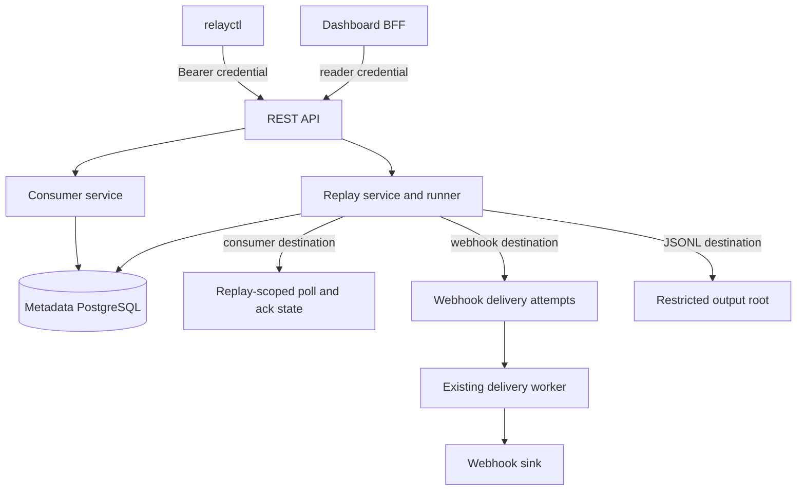
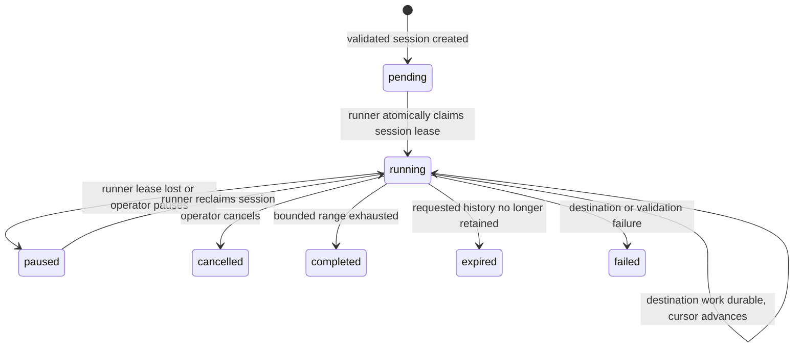

# feat: Complete RelayDB core runtime

**Target repo:** `relaydb`

## Summary

Complete the functional runtime that the initial CDC platform scaffold intentionally left unfinished: authenticated operator commands, fenced consumer redelivery, resumable replay, and real PostgreSQL proof coverage. The work extends the existing REST, gRPC, webhook, persistence, dashboard, and compose boundaries instead of redesigning the CDC architecture.

---

## Problem Frame

RelayDB's capture, webhook delivery loop, dashboard BFF, and deployment configuration now run locally, but several advertised runtime capabilities are still stubs or storage-only. `relayctl` has no HTTP implementation, consumer NACK only logs, replay sessions never execute, and the integration/failure suites start containers without proving the critical invariants. This leaves a misleading gap between the dashboard's honest placeholders and the platform's claimed operator workflow.

The completion work must preserve the platform's existing guarantees: event order is `(commit_end_lsn, sequence_number)`, consumer writes are lease-fenced, capture only acknowledges persisted WAL, webhooks remain at-least-once, and replay never moves a live consumer offset.

---

## Requirements

**Operator commands**

- R1. `relayctl` performs authenticated REST requests using the existing `Bearer keyID:key` contract and implements its advertised source, event, replay, and DLQ commands with stable machine-readable and human-readable output.
- R2. REST exposes only the source, event, replay, consumer-status, and DLQ actions that have working backend behavior; authorization continues to distinguish read and mutation access.

**Consumer redelivery**

- R3. Poll, ACK, NACK, and heartbeat carry and enforce the current partition lease generation, preserve per-partition order, and reject stale or expired owners.
- R4. A NACK persists a retry deadline and per-event attempt history. When the configured threshold is reached, `dlq` records the poison event and permits the partition to continue; `halt` persists a visible stopped partition without advancing its offset.

**Replay execution**

- R5. Replay sessions resolve their requested range against persisted events, progress with a durable `(commit_end_lsn, sequence_number)` cursor, resume after process interruption, and never mutate live consumer offsets.
- R6. Replay supports the existing consumer, webhook, and JSONL destinations. Webhook replay uses the normal delivery policy with a replay-specific idempotency scope; consumer replay uses replay-owned acknowledgment state; JSONL is restricted to an operator-approved output root and declares its at-least-once file semantics.

**Proof and truthful exposure**

- R7. Real PostgreSQL tests prove capture durability, capture/consumer fencing, redelivery and poison handling, replay progression/destinations, and webhook retry/DLQ outcomes. CI runs those suites.
- R8. The existing dashboard and deployment topology remain intact. API and dashboard changes expose replay, consumer, and DLQ capabilities only when their runtime behavior is implemented.

---

## Key Technical Decisions

- KTD-1. **Repair the existing consumer contract before adding poison handling:** propagate the claimed lease object through Poll, renew it through Heartbeat, parse persisted offsets, use the group's partition count, and bind ACK/NACK to a durable issued-delivery record. One transaction validates the unexpired owner/generation, verifies the issued head event or range, and updates offset, redelivery, and DLQ state; a separate lease check followed by an offset update is not sufficient.
- KTD-2. **Persist consumer redelivery separately from the live offset:** a per-group, per-partition, per-event record holds the scheduled retry, NACK attempt count, issued ownership, and terminal result. The earliest blocked event prevents later events in that partition from bypassing it; a crash before ACK redelivers without counting as an explicit NACK.
- KTD-3. **Use a replay-owned cursor and execution lease:** the REST start action leaves a validated session pending; the API-process runner atomically changes it to running while acquiring owner, generation, expiry, and heartbeat fields. On startup it scans pending and lease-expired sessions, renews active leases, and compares generation before cursor or terminal updates. Cursor updates always include LSN and sequence, not LSN alone.
- KTD-4. **Preserve destination-specific semantics behind one replay dispatcher:** replay consumer delivery uses its own session/event claim and acknowledgment state and never calls the live consumer service or lease manager. Webhook replay creates durable replay-scoped work; the cursor advances after enqueue, while the existing worker owns at-least-once external delivery. Scope-aware enqueue suppression, claiming, retries, DLQ insertion, and retry lookup let live and replay attempts for the same event/sink coexist. JSONL validates a relative path below a configured root, syncs each emitted batch before recording its cursor, and includes event IDs for downstream deduplication.
- KTD-5. **Keep `relayctl` a thin REST client:** command parsing and output stay in `cmd/relayctl`; shared request creation, credentials, status-to-error mapping, paging, and JSON decoding live behind a small internal client. The CLI does not reach PostgreSQL or bypass API authorization.
- KTD-6. **Make the test harness an executable representation of the runtime:** source PostgreSQL starts with logical replication enabled at container creation, metadata migrations use the embedded migrator, and deterministic hooks pause capture or worker boundaries instead of asserting internal implementation details. The migration suite proves both fresh installs and upgrades from the current schema with pre-existing offsets, attempts, DLQ rows, and replay sessions.
- KTD-7. **Treat the dashboard as a read/operator surface:** retain its BFF and existing visual language. Enable replay and consumer screens only after their status APIs are wired; DLQ mutation controls appear only for retryable records with an implemented backend action.

---

## High-Level Technical Design

### Runtime ownership



### Replay lifecycle and cursor advancement



---

## Scope Boundaries

In scope: the core runtime paths named in R1-R8, required migration copies, API and gRPC contract corrections, real PostgreSQL test infrastructure, and narrow dashboard state/action exposure.

### Deferred to Follow-Up Work

- A new dashboard visual direction, compose topology changes, Railway/Vercel deployment redesign, or a standalone replay worker binary.
- Tenant-grade key storage, RBAC, broad gRPC authentication redesign, streaming subscriptions, and consumer-group assignment optimization beyond the correctness fixes required here.
- Initial snapshots, retention cleanup, replay transformations, or new sink types.
- Full webhook egress hardening and circuit-breaker work that is not necessary to route replay through the existing delivery path.

---

## System-Wide Impact

- **Persistence:** the canonical `migrations/` directory and the embedded `internal/persistence/migrations/` copy must receive identical numbered migrations. New delivery identity and replay cursor data must keep existing live webhook rows valid.
- **Migration lifecycle:** migrations backfill a non-null live delivery scope before adding scoped uniqueness, preserve legacy nullable DLQ owners without duplicate rows, and apply transactionally through the same embedded path used by binaries.
- **Contracts:** gRPC changes must regenerate `gen/` through the existing Buf workflow. REST DTOs remain redacted and dashboard-compatible through the BFF.
- **Operational behavior:** API restart must leave a replay resumable, a stale capture/consumer must fail fenced writes, and JSONL output must not claim exactly-once delivery.
- **Build and test:** logical replication is an integration prerequisite, so the test harness and CI must start PostgreSQL with the required server settings instead of applying `wal_level` after startup.

---

## Risks and Dependencies

| Risk | Mitigation |
| --- | --- |
| A NACK state model lets later events bypass a failed earlier event | Query eligible redelivery before new events and test that partition order remains blocked until DLQ or successful ACK. |
| Replay webhook rows collide with live `(sink, event)` delivery rows | Add an explicit replay delivery scope and assert a live delivery and replay delivery can coexist with distinct idempotency keys. |
| Nullable owner columns defeat existing DLQ uniqueness | Normalize a non-null scope/owner key or use partial unique indexes, then prove duplicate retry workers create one active DLQ row. |
| A crash between JSONL write and cursor persistence emits one final duplicate | Sync output before cursor update, include event IDs, and document at-least-once file semantics. |
| Testcontainers starts a non-logical source database | Set PostgreSQL server parameters at container creation and verify slot/publication creation in the shared harness. |
| Migration drift makes binaries apply different schemas | Add each numbered migration to both copies and test the API migration path used by the runtime. |
| Dashboard claims a capability during partial rollout | Keep unavailable states until status/action endpoints are backed by real service transitions. |

Dependencies: Docker/Testcontainers, PostgreSQL 16 logical replication, the existing Go 1.26.5 toolchain, Buf for generated gRPC code, and the existing dashboard pnpm workspace.

---

## Implementation Units

### U1. Correct consumer fencing and persist redelivery state

**Goal:** Make the existing gRPC consumer lifecycle reliable enough for NACK scheduling and poison policy enforcement.

**Requirements:** R3, R4

**Dependencies:** none

**Files:** `migrations/002_consumer_redelivery.sql`, `internal/persistence/migrations/002_consumer_redelivery.sql`, `internal/consumer/groups.go`, `internal/consumer/deliveries.go`, `internal/consumer/offsets.go`, `internal/consumer/groups_test.go`, `internal/consumer/deliveries_test.go`, `internal/lease/lease.go`, `internal/lease/lease_test.go`, `internal/grpc/server.go`, `internal/grpc/server_test.go`, `proto/relaydb.proto`, `gen/relaydb.pb.go`, `gen/relaydb_grpc.pb.go`

**Approach:** Add schema for per-event issued deliveries/redelivery attempts and visible halted-partition state, retaining the existing text-plus-CHECK policy values. Return the claimed lease generation and expiry from Poll, have Heartbeat renew it through the lease manager, and record the issued head event or range with that ownership. ACK/NACK runs as one fenced transaction that validates the delivery record and lease before changing offset, retry, DLQ, or halt state. Poll must use each group's configured partition count and parse canonical LSN text before querying. NACK stores retry eligibility for the head event; reaching `max_attempts` creates one consumer-group DLQ record and advances only for `dlq`, while `halt` leaves the offset unchanged and prevents further polls for that partition. Regenerate protobuf artifacts only for contract fields needed to report the real lease/terminal state.

**Patterns to follow:** `internal/lease/lease.go` for database-time fencing, `internal/webhook/service.go` for attempt-state transitions and DLQ persistence, `internal/dlq/dlq.go` for consumer-group DLQ rows, and `migrations/001_init.sql` for duplicated migration conventions.

**Test scenarios:**

- A claimed lease's generation and expiry are returned by Poll; ACK and Heartbeat with those values succeed.
- A stale generation and a generation with an expired lease both fail without advancing the offset.
- ACK/NACK of an unissued, duplicate, out-of-order, or cross-partition event is rejected without changing delivery, DLQ, or cursor state.
- A member polling its own active partition renews or retains its lease; a competing member cannot claim it until expiry.
- A NACK defers exactly the specified head event, increments only its explicit NACK counter, and redelivers it after its configured deadline before later partition events.
- A crash before ACK causes the same event ID to reappear after lease takeover without consuming a poison attempt.
- At the configured threshold, `dlq` creates one active consumer DLQ row and allows the next ordered event; `halt` reports the stopped partition and leaves its cursor unchanged.

**Verification:** Consumer service and gRPC tests prove lease fencing, redelivery ordering, both poison outcomes, and no live offset regression.

### U2. Implement replay execution and destination dispatch

**Goal:** Turn persisted replay sessions into resumable event processing with destination-specific, honest delivery semantics.

**Requirements:** R5, R6

**Dependencies:** U1

**Files:** `migrations/003_replay_execution.sql`, `internal/persistence/migrations/003_replay_execution.sql`, `internal/config/config.go`, `internal/config/config_test.go`, `internal/replay/session.go`, `internal/replay/cursor.go`, `internal/replay/runner.go`, `internal/replay/destinations.go`, `internal/replay/consumer.go`, `internal/replay/jsonl.go`, `internal/replay/session_test.go`, `internal/replay/runner_test.go`, `internal/replay/consumer_test.go`, `internal/replay/jsonl_test.go`, `internal/webhook/service.go`, `internal/webhook/service_test.go`, `internal/grpc/server.go`, `internal/grpc/server_test.go`, `proto/relaydb.proto`, `gen/relaydb.pb.go`, `gen/relaydb_grpc.pb.go`, `cmd/api/main.go`

**Approach:** Validate exactly one start selector, ordered bounds, filters, and destination configuration before leaving a session pending. Normalize selectors to the canonical event position with validated LSN parsing, then let the API-process runner atomically claim pending or lease-expired work and renew its lease until context shutdown. Persist cursor LSN and sequence, counts, status, and failure information only after a destination batch is durable. Consumer replay uses replay-owned session/event claims and acknowledgments, never live group offsets or partition leases. Webhook replay creates replay-scoped attempts and DLQ rows with scope-aware uniqueness and a migration for existing live rows; update live enqueue suppression, worker claims, retry inserts, DLQ insertion, and retry lookup so neither path suppresses nor duplicates the other. JSONL accepts only a canonicalized relative path below `RELAYDB_REPLAY_OUTPUT_ROOT`, rejects symlink escapes and collisions, syncs batches before cursor persistence, and documents event-ID deduplication after a crash boundary. The API composition root starts and stops the persisted runner; no new process or compose service is introduced.

**Patterns to follow:** `internal/replay/session.go` for session persistence, `internal/webhook/service.go` for claimed retry work, `internal/consumer/groups.go` for pull/ack semantics, `internal/eventstore/types.go` for the canonical event envelope, and `cmd/delivery/main.go` for cancellation-aware worker wiring.

**Test scenarios:**

- Time, LSN, and event-ID selectors resolve to the correct inclusive start and bounded end positions.
- A replay advances the exact `(LSN, sequence)` cursor over a filtered multi-transaction range and resumes from that position after runner restart.
- Existing PostgreSQL LSN text containing `/` round-trips through session and cursor reads without changing ordering.
- Two runners race for one session and only the active generation can advance, cancel, fail, or complete it; cancellation at a batch boundary cannot commit a later cursor.
- Runner startup claims pending or lease-expired work, renews until shutdown, and safely resumes when the API process restarts.
- Cancellation stops further dispatch and retains truthful processed counts; a pruned start range transitions to `expired` rather than completing.
- Consumer replay acknowledgments advance only replay state and leave the referenced live group offset byte-for-byte unchanged.
- A replay webhook attempt coexists with a live webhook attempt for the same event, uses replay-qualified attempt and DLQ scope plus idempotency, and follows the existing retry/DLQ policy without duplicate active DLQ rows after worker retry.
- JSONL output stays inside the configured root, rejects unsafe destinations, emits valid newline-delimited envelopes, and documents/reveals duplicate-last-record behavior after a simulated crash.

**Verification:** Replay unit and PostgreSQL integration tests prove cursor resumability, destination isolation, and no mutation of live consumer state.

### U3. Expose functional REST operations and relayctl commands

**Goal:** Give operators one authenticated, API-mediated path to inspect and control the now-functional runtime.

**Requirements:** R1, R2, R5, R8

**Dependencies:** U1, U2

**Files:** `internal/api/server.go`, `internal/api/server_test.go`, `internal/api/events.go`, `internal/api/replays.go`, `internal/api/consumers.go`, `internal/api/dlq.go`, `cmd/api/main.go`, `cmd/relayctl/main.go`, `cmd/relayctl/client.go`, `cmd/relayctl/commands_test.go`, `internal/dlq/dlq.go`, `internal/dlq/dlq_test.go`

**Approach:** Wire replay, consumer-status, and DLQ services into the existing API server. Add authenticated replay create/start/get/list/cancel operations, read-only consumer partition status, and DLQ retry through an owner-dispatch path that transactionally requeues webhook work or resets supported consumer replay state. Define reader credentials for inspection and explicit admin credential selection for replay or retry mutations before formatting command output. Add count and ascending keyset-tail REST contracts with source/filter parameters, explicit cursor direction, and cancellation semantics before implementing the advertised source list/status, event tail/count, replay start/status/list, and DLQ list/retry commands. The context-aware HTTP client sets the established bearer credential, bounds request time, parses API errors, follows pagination/tailing cursors, and preserves JSON output for automation. Keep source credentials write-only and retain reader versus mutation authorization in the handlers.

**Patterns to follow:** `internal/api/server.go` routing/auth/error helpers, `dashboard/app/api/v1/[...path]/route.ts` for the current bearer forwarding shape, `internal/dlq/dlq.go` for status transitions, and `cmd/relayctl/main.go` for the existing command vocabulary.

**Test scenarios:**

- Every CLI request supplies the configured credential and returns a clear typed error for unauthorized, missing, and malformed API responses.
- Source and event commands render both a readable table and valid JSON without exposing credential data.
- Event tail uses a monotonic cursor, prints newly observed events once per poll, and stops cleanly when its context is cancelled.
- Event count and tail use documented source/filter and pagination contracts rather than deriving totals or forward progress from the fixed descending event-list response.
- Replay start validates destination and range errors through the API, then status/list reports durable progress and terminal state.
- DLQ list distinguishes consumer and webhook rows; retry only succeeds for a retryable, supported owner and records the resulting state transition.
- Reader credentials cannot invoke mutation endpoints; admin credentials can start/cancel replay and retry supported DLQ work.

**Verification:** API contract and CLI tests demonstrate that every displayed command maps to a real protected endpoint rather than a placeholder message.

### U4. Replace integration and failure placeholders with PostgreSQL proof scenes

**Goal:** Make the CDC correctness claims executable against real logical replication and metadata PostgreSQL.

**Requirements:** R3, R4, R5, R6, R7

**Dependencies:** U1, U2

**Files:** `tests/integration/harness_test.go`, `tests/integration/workflow_test.go`, `tests/integration/replay_test.go`, `tests/failure/harness_test.go`, `tests/failure/checkpoint_windows_test.go`, `tests/failure/consumer_crash_test.go`, `tests/failure/ownership_race_test.go`, `tests/failure/delivery_retry_test.go`, `internal/capture/service.go`, `internal/capture/service_test.go`, `internal/checkpoint/checkpoint_test.go`, `docker-compose.test.yml`

**Approach:** Build a shared testcontainers harness with a source image configured for logical replication before boot, a migrated metadata database, unique publications/slots, and lifecycle helpers for in-process capture, consumer, replay, and webhook test servers. Create the planned integration harness and replay proof file, while migrating existing failure placeholders onto the shared lifecycle helpers. Add narrowly scoped test-only crash/pause hooks at capture persistence/ack and replay/delivery boundaries. Test both a fresh installation and an upgrade from the current schema with existing offset, delivery, DLQ, and replay rows. Replace all `t.Log` placeholders with observable proof scenes that inspect durable events, checkpoints, lease generations, offsets, replay sessions, delivery attempts, and DLQ rows instead of service logs. The shared harness verifies logical replication, runs the embedded migrator, and supplies isolated source/metadata URLs used unchanged by CI.

**Patterns to follow:** `tests/failure/harness_test.go` for the existing scene names, `internal/capture/service.go` for fenced ingest and checkpoint ordering, `internal/webhook/service.go` for retry state, and `docs/demo/failure-scenes.md` for operator-facing scenario terminology.

**Test scenarios:**

- INSERT, UPDATE, DELETE, and multi-table source transactions are captured once with transaction ordering and a persisted checkpoint.
- Capture crash before persistence leaves no partial events; crash after persistence before ACK replays idempotently; metadata outage and source restart resume without acknowledging unavailable work.
- Two capture instances and two consumer members prove stale fenced writes/ACKs fail after ownership takeover.
- Consumer crash before ACK redelivers the same IDs, NACK retry deadlines survive service restart, and each poison policy reaches its defined terminal result.
- Replay cursor progression survives runner restart across consumer, webhook, and JSONL destinations without touching live offsets.
- Retryable webhook failures schedule retries, permanent/exhausted failures reach DLQ, and an implemented retry action returns work to the correct delivery owner.

**Execution note:** Start by converting the current placeholder tests into failing real-database scenarios, then add only the hooks required to make each stated crash boundary deterministic.

**Verification:** The integration and failure suites run against PostgreSQL 16 logical replication without skipped placeholders, fixed host ports, or timing sleeps as correctness assertions.

### U5. Surface implemented runtime state in the existing dashboard

**Goal:** Replace only the dashboard placeholders that have a backed API contract and keep unavailable behavior visibly unavailable until it exists.

**Requirements:** R2, R4, R5, R8

**Dependencies:** U1, U2, U3

**Files:** `dashboard/app/replays/page.tsx`, `dashboard/app/consumers/page.tsx`, `dashboard/app/dlq/page.tsx`, `dashboard/lib/api.ts`, `dashboard/tests/runtime-capabilities.spec.ts`, `dashboard/playwright.config.ts`, `dashboard/package.json`

**Approach:** Retain the dashboard's server-side BFF and dense operations visual language. Render replay status, destination, processed count, and terminal errors from the new read API; render consumer partition ownership, lease generation/expiry, cursor, retry deadline, and halted state; and show DLQ retry controls only for entries supported by the corresponding backend. Use bounded polling or an explicit refresh with last-updated/stale/error state, preserve displayed rows during refresh, and make mutation controls disabled while pending with accessible success/failure announcements. Do not add source creation, compose controls, secrets, or speculative progress indicators.

**Patterns to follow:** `dashboard/app/dlq/page.tsx` for BFF data loading/error states, `dashboard/app/api/v1/[...path]/route.ts` for server-side key forwarding, and the current unavailable-state treatment in `dashboard/app/replays/page.tsx` and `dashboard/app/consumers/page.tsx`.

**Test scenarios:**

- A replay page displays pending, running, completed, failed, expired, and cancelled data from the API without claiming a session is executable before it is started.
- Consumer status distinguishes active, retry-delayed, and halted partitions and never displays a stale lease as active after expiry.
- DLQ retry is visible only when the API marks the record retryable; success refreshes the row state and errors remain visible to the operator.
- The BFF keeps credentials out of browser requests while forwarding the expected reader authorization server-side.
- Replay start/cancel and DLQ retry have pending, duplicate-submit, success, failure, and keyboard-focus states with status or alert announcements; navigation exposes the active route semantically.

**Verification:** Browser coverage against a seeded API response verifies the enabled controls and unavailable states match actual backend capability.

### U6. Enforce runtime proof in build, deployment, and operator documentation

**Goal:** Make the completed core runtime reproducible in local and CI workflows without changing the current deployment topology.

**Requirements:** R7, R8

**Dependencies:** U4, U5

**Files:** `Makefile`, `.github/workflows/ci.yml`, `docker-compose.yml`, `docs/deployment.md`, `docs/HANDOFF.md`, `README.md`, `docs/demo/failure-scenes.md`

**Approach:** Keep the existing services and dashboard proxy unchanged unless configuration is required for replay output safety or the new test stack. Define `RELAYDB_REPLAY_OUTPUT_ROOT` with a conservative production default, compose wiring, and documentation. Add explicit integration/failure targets to the CI gate with a logical-replication-configured source database, a separate migrated metadata database, isolated source/metadata URLs, and slot/publication cleanup shared with the test harness. Update the operator docs to describe actual replay destination semantics, poison-policy outcomes, CLI auth setup, and at-least-once JSONL/webhook guarantees. Remove stale handoff claims only after the matching proof suites are in place.

**Patterns to follow:** existing targets in `Makefile`, the compose health-check workflow in `.github/workflows/ci.yml`, and the current capability/status framing in `docs/HANDOFF.md` and `docs/deployment.md`.

**Test scenarios:**

- CI executes unit, race, integration, failure, generated-protobuf, binary-build, dashboard-build, and compose-validation gates with the required PostgreSQL configuration.
- The documented local path produces authenticated CLI output, a replay status transition, a poison-policy outcome, and a recoverable delivery retry without changing service topology.
- Deployment documentation never promises exactly-once side effects or managed file export behavior that the runtime does not provide.

**Verification:** The repository's documented validation sequence and CI job both exercise the same real runtime contracts.

---

## Verification Commands

Run these after implementation with the documented Go toolchain and Docker available:

```powershell
make fmt
make vet
make lint
make proto
go test -race ./internal/consumer/... ./internal/lease/... ./internal/replay/... ./internal/api/... ./internal/grpc/... ./internal/webhook/... ./internal/dlq/... ./cmd/relayctl/...
make test-integration
make test-failure
make test-all
pnpm --dir dashboard build
docker compose config --quiet
docker compose up -d --wait
```

Confirm the compose health endpoints respond, then run the documented operator proof scenes: capture a source transaction, NACK it to a retry and poison outcome, execute each replay destination, and retry an induced webhook failure from the DLQ.

---

## Sources and Research

- `docs/HANDOFF.md` is the current-state authority for finished work and remaining functional gaps.
- `docs/plans/2026-08-18-001-feat-relaydb-cdc-platform-plan.md` supplies the retained CDC, lease, replay, webhook, and test decisions, especially durable at-least-once behavior and canonical stream position.
- `internal/consumer/groups.go`, `internal/lease/lease.go`, and `internal/grpc/server.go` show the current ownership and NACK gaps that U1 must correct before policy work is reliable.
- `internal/replay/session.go`, `internal/webhook/service.go`, and `migrations/001_init.sql` establish the existing session, delivery, and destination contracts extended by U2.
- `tests/integration/workflow_test.go` and `tests/failure/*.go` identify the current placeholder proof scenes; `Makefile` and `.github/workflows/ci.yml` provide the existing validation entry points.